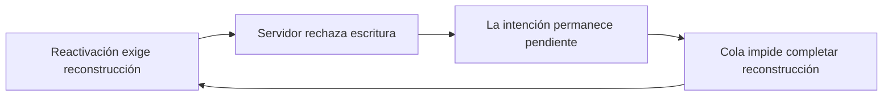

# Sincronización, identidad y recuperación: evaluación arquitectónica

**Riesgo:** H-164, un problema de coherencia y recuperación entre capas.
**Estado:** ABIERTO. Diagnóstico y comparación completados; defectos sin corregir.
**Fecha:** 11/09/2026, Hermosillo; consultas del 12/09/2026 UTC.
**Commit:** Pendiente de commit.
**Certificación distribuida:** NO CERTIFICADO.

## Problema y reproducción

El propietario reporta 14 equipos cuando operan tres, un pendiente/bloqueado
después de Punto Cero, aviso de cliente antiguo aun usando el actual y bloqueo
de Actualizar por un diálogo inexistente. Solicita evaluar mantener local-first
frente a cloud-first/online-only. El resultado de esta evaluación es una decisión
propuesta con evidencia y condiciones de aceptación; no cambia aún el contrato
offline ni equivale a cerrar los defectos.

La raíz del workspace conserva un enlace Git roto y fuentes anteriores. Se
localizó `.h156-release`, se consultó `main` y se creó el checkout independiente
`.h164-sync-evaluation` sobre `9c70ac2`. A las 04:56:19 UTC se descargó la raíz
pública: HTTP 200, 9,075,086 bytes, SHA-256
`a68d115f9771c648d5ee3a17a79302ba7e5dd35ca580843debb4e4301b4061e0`.
Coincide con H163, no con el HTML H160 disponible inicialmente. STORE, CORE,
DATA, PWA, Clientes y Configuración no cambiaron entre esas revisiones.

La lectura de Supabase del 12/09 a las 05:03:47 UTC, sin escrituras, observó:

- 14 instalaciones registradas, 13 retiradas y una no retirada. Tres IDs son
  instalaciones QA A/B/C. El registro no identifica tres puestos físicos.
- La instalación no retirada declara `must_rebootstrap`, cola 1/1,
  `reactivation_requires_sync=true` y una señal de las 05:03:43 UTC.
- Manifiesto en época 10, protocolo mínimo/actual 3, esquema
  `20260830017500` y `minimum_client_build=null`; el cliente declara protocolo
  y esquema compatibles. Su etiqueta de build es H155, aun en el HTML H163.
- La actividad accionable es un upsert de productos en cuarentena,
  `P0001`, categoría `compatibility`, política `rebootstrap`, con el mensaje
  «Este equipo debe actualizar su información antes de guardar.».
- Esa actividad fue registrada por el servidor a las 02:49:57 UTC, después
  del Punto Cero de las 00:07:48 UTC. Es la primera observación remota, no una
  prueba de cuándo se capturó localmente ni de su contenido. No se ha probado
  que sea una operación fantasma, ni se autoriza descartarla por su conteo.

La época que declara el heartbeat se toma del manifiesto remoto
(`store.jsx:3189`); no prueba por sí sola la reconstrucción durable de la época
local. No se leyó ni modificó el almacenamiento del navegador físico.

La sonda Chromium sobre el HTML H163 reprodujo cuatro estados: Panel permite
actualizar; Inventario bloquea sin abrir un detalle; Clientes bloquea igual;
volver a Panel libera. Los dos nodos bloqueantes estaban vacíos, fuera del
viewport y sin botón para cerrarlos. Actividad cero, cola durable, cero errores
JavaScript y solicitudes externas abortadas en el navegador de prueba.

## Causa raíz

No hay evidencia de una sola función que origine los cuatro síntomas. Sí hay
contratos incompatibles entre identidad, autorización de escritura, recuperación,
telemetría y estado de interfaz. La cola offline amplifica sus consecuencias.

### El pendiente queda encerrado en el protocolo de reactivación

La migración `20260910019800_pos_h154_device_retirement.sql` establece:
al reactivar, `reactivation_requires_sync=true` (línea 632); la guarda rechaza
escrituras mientras sea verdadero (588); el heartbeat sólo lo libera con
estado online, cola cero, época y cursores comprobados (679–695).

El cliente intenta vaciar la cola antes de reconstruir (`store.jsx:3765`), y
los dominios con intención pendiente no aplican remoto (`:2887`, `:3067`). Si
un dominio no se aplica, la reconstrucción falla (`:3775`). La operación
rechazada no puede salir por confirmación; impide la condición que permitiría
que el servidor la aceptase. El estado y mensaje observados son los que activa
la guarda de reactivación. La sonda de siete funciones originales reproduce
dos intentos fallidos con `REBOOTSTRAP_DOMAIN_INCOMPLETE:products`, un pendiente
conservado, cero lecturas de productos, cero archivos y cero checkpoints.
El transporte simula el rechazo SQL observado; no es una ejecución de reparación
en el equipo físico ni una reproducción sobre el payload original.

Reintentar no cambia la precondición. Reactivar de nuevo vuelve a establecerla.
La cuarentena automática H155 se limita a ciertos conflictos de producto,
no a este rechazo de compatibilidad (`store.jsx:3551`). No corresponde borrar
la cola, cambiar el ID del navegador ni falsificar un heartbeat limpio.

### Instalación, puesto operativo e historia se presentan juntos

`CORE.getDeviceId()` (`core.jsx:13`) identifica una partición de almacenamiento.
Otra partición, almacenamiento borrado o un nuevo arranque sin almacenamiento
durable pueden crear otra identidad. H18 garantiza identidad compartida entre
módulos, no un censo físico. No existe base para fusionar automáticamente IDs.

`syncFleetStatus()` lee todas las instalaciones (`store.jsx:4084`), y el Centro
usa `devices.length` (`settings.jsx:1442`) y dibuja todas (`:1454`). Los conteos
de cola se muestran sin convertir los retirados en historia (`:1474`). La
derivación de atención (`store.jsx:4113`) no exige instalación vigente ni señal
reciente. La sonda de funciones originales reprodujo 3 activas + 11 retiradas
como 14 y una incidencia de un retirado de 100 días aún accionable. Ese fixture
demuestra el mecanismo; no sustituye la lectura real 1 no retirada + 13 retiradas.

Además, SQL devuelve `false` al heartbeat de una instalación retirada (678),
pero el cliente sólo comprueba `report.error` (`store.jsx:3195`). La sonda
reproduce `synchronized=true` y hora de éxito ante `{data:false,error:null}`.
El rechazo `DEVICE_RETIRED` se clasifica como `unknown/auto_retry` por
`classifyFailure()` (`:689`). Ambos defectos sobreviven a online-only.

### El diagnóstico confunde código, datos y autorización

`manifestCompatibility()` (`store.jsx:3136`) compara protocolo/esquema;
`loadSyncProtocol()` (`:3142`) añade época y puede exigir reconstrucción.
Configuración transforma cualquier incompatibilidad en actualizar BALAM
(`settings.jsx:2011`, `:2395`). El servidor también usa ese consejo para
recuperación o una intención descartada (SQL H154:594–601).

`SYNC_CLIENT_BUILD` permanece `2026-09-11-h155` (`store.jsx:20`) en el artefacto
H163. Esa etiqueta no identifica los bytes ejecutados. La consulta actual no
muestra un requisito de build que explique el bloqueo: muestra reconstrucción
pendiente tras reactivar. Descargar otra vez el cliente no elimina esa condición.

La recuperación automática H151 exige un evento de limpieza selectiva de la
época exacta (`store.jsx:2589`). No acredita recuperación automática universal
después de Punto Cero global. H160 deja la adopción física sin certificar.

### Un panel cerrado satisface la guarda de diálogo abierto

`PWA.reloadSafety()` (`pwa.jsx:246`) consulta cualquier
`[role="dialog"][aria-modal="true"]`. Inventario monta siempre el detalle
(`inventory.jsx:435`), que conserva esos atributos cuando está cerrado (`:494`).
Clientes repite el contrato (`clients.jsx:170`, `:190`). No hace falta un modal
huérfano: el estado cerrado normal provoca el fallo. La guarda debe responder
a apertura/captura real y conservar el bloqueo de una operación auténtica.

## Diseño: comparación y decisión propuesta

**Recomendación condicionada:** adoptar cloud-first para confirmar operaciones
comerciales, conservando caché de lectura identificada y borradores locales,
si el negocio acepta detener esas confirmaciones cuando falten Internet o
Supabase. No hay beneficio adicional demostrado para retirar toda lectura y
borrador local. La solicitud de evaluación no se interpreta como aprobación
de retirar la venta offline; la tolerancia a esa interrupción sigue pendiente.

| Dimensión | Local-first reparado | Cloud-first con caché/borradores | Online-only integral |
|---|---|---|---|
| Confirmar sin red | Sí, sujeto a aceptación remota posterior | No | No |
| Momento del éxito comercial | Primero local, después SQL | Tras confirmación SQL | Tras confirmación SQL |
| Operaciones offline acumuladas | Se conservan con recuperación completa | Se retiran para nuevas operaciones | Igual |
| Consulta sin red | Último estado conocido | Último estado conocido, marcado | Indisponible |
| Respuesta perdida después de commit | Requiere idempotencia | También | También |
| Conflicto simultáneo de stock/edición | Defensa SQL y conciliación | Defensa SQL antes del éxito | Igual |
| Identidad, retiro, diálogo, versión de app | Corrección necesaria | Corrección necesaria | Corrección necesaria |
| Complejidad que permanece | Cola, propietarios, replay, cuarentena, réplicas | Resultados inciertos, lecturas, borradores, despliegues | Resultados inciertos, vistas y despliegues |
| Riesgo operativo dominante | Rechazo y recuperación posterior | Latencia o interrupción antes de confirmar | Lo anterior también afecta consultas |
| Costo de transición | Cerrar el protocolo y sus pruebas | Separar todas las mutaciones de su confirmación | Lo anterior y retirar persistencia/consultas locales |

El número de equipos no basta para elegir. No se dispone de mediciones de
ventas realmente salvadas por offline, duración de cortes, tiempos de soporte
ni latencia comercial de los tres puestos. No se asignan puntajes, porcentajes
de ahorro, presupuesto ni plazo sin esa base. Medir minutos de interrupción,
ventas afectadas, p50/p95/p99 de confirmación y recepción, resultados inciertos,
conflictos y tiempo hasta recuperación permite comparar el costo de detenerse
con el de operar provisionalmente y resolver después.

La frontera concreta es `DATA.recordSale()` (`data.jsx:2784`): modifica stock,
cliente, comisión, venta y pago antes del envío; `:2962` invoca el gateway sin
esperar confirmación y `pos.jsx:255` presenta éxito. `STORE.run()` (`:1650`)
espera la cola durable y dispara el envío, no devuelve el recibo comercial.
Añadir simplemente `await pushSale()` no implementa cloud-first.

La separación propuesta es preparación pura → solicitud con ID estable →
confirmación SQL → aplicación de la respuesta y comprobante. Ya hay antecedente
en `DATA.liquidarApartado()` (`:3056`) y `STORE.settleLayaway()` (`:2216`).
También deben convertirse inventario, clientes, promociones, pagos, devoluciones,
cambios, préstamos, comisiones, configuración y catálogos: dejar mutaciones
optimistas en otros dominios conservaría parte de los mismos bloqueos.

Se conservan Supabase, Auth, RLS/capacidades, RPC transaccionales, cálculos,
identidades y folios, aliases, V1/V2/V3, snapshots históricos e impresión. El
shell PWA autocontenido es compatible con exigir red al confirmar. SQL sigue
siendo necesario: cada petición PostgREST tiene su propia transacción; varias
llamadas no constituyen una transacción comercial conjunta. Fuente:
[PostgREST, transacciones](https://docs.postgrest.org/en/stable/references/transactions.html).

Con dos clientes conectados siguen existiendo conflictos de concurrencia;
H156 permanece abierto para clientes/promociones. Cambiar la arquitectura no
repara esa guarda SQL. Los niveles de aislamiento requieren decisiones
explícitas y, en ciertos casos, reintentos. Fuente:
[PostgreSQL, aislamiento](https://www.postgresql.org/docs/current/transaction-iso.html).

Si el servidor confirma y se pierde la respuesta, conservar la misma identidad,
comprobar el resultado y reintentar idempotentemente. El registro durable de una
solicitud en vuelo no autoriza nuevas ventas offline. No imprimir éxito ni pedir
otro cobro mientras el resultado sea incierto. Revisar el tratamiento del dinero
ya recibido: PostgreSQL no revierte efectivo ni transferencias externas.

Realtime sigue siendo una señal para leer la autoridad, con recuperación por
consulta al reconectar; no garantiza todos los mensajes. Fuente:
[Supabase Realtime, entrega](https://github.com/supabase/realtime#does-this-server-guarantee-message-delivery).

### Contratos que deben cerrarse en cualquier alternativa

1. Un puesto operativo se enrola explícitamente; sus instalaciones/sesiones se
   distinguen del historial. Retiro y reemplazo conservan trazabilidad y no
   reactivan automáticamente identidades antiguas ni suman QA al censo comercial.
2. El protocolo de recuperación puede comprobar una proyección y obtener una
   autorización de escritura sin ejecutar antes la intención que está cercada.
   Separar temporalmente esa intención en almacenamiento durable ya existente,
   por identidad exacta, conservarla, reconstruir y comprobar contra el servidor;
   sólo después decidir su envío vigente o revisión. Nunca declarar la intención
   aceptada porque terminó la reconstrucción. La costura necesita diseño SQL y
   pruebas de carrera; una bandera de éxito local no es solución.
3. Cada bloqueo expone causa, responsable y salida: reactivar instalación,
   reconstruir datos, revisar intención, iniciar sesión, resolver conflicto o
   actualizar aplicación. Una señal antigua se muestra como desconocida/histórica.
4. Versionar y observar separadamente artefacto ejecutado, protocolo, esquema,
   época local comprobada, época remota y estado de autorización de instalación.
   La respuesta del heartbeat debe confirmar aceptación y estado, no sólo HTTP.
5. La actualización protege borradores y diálogos abiertos. Un panel cerrado
   no bloquea. Probar también PWA instalada: el control de cabecera actual se
   oculta en standalone (`pwa.jsx:368`), independientemente de una actualización.

### Transición y verificación para un cierre completo

Primero resolver el protocolo de recuperación y representación dentro de H164;
no limpiar síntomas con una nueva identidad o reseteo indiscriminado. Antes de
intervenir la instalación real, obtener export exacto y comparar operaciones
con sus recibos. El pendiente observado no se descarta sin decisión sobre su
contenido. Después confirmar la tolerancia a detener operaciones y, si se
aprueba, registrar una decisión que sustituya explícitamente el alcance offline
de ADR-006 y ajustar R-CLI-03 y los contratos de cola/offline de ADR-012/014.
Las decisiones vigentes no se cambian en esta evaluación.

Implementar la confirmación del servidor inicialmente desactivada, servidor
compatible primero, canario por dominio/instalación y conversión sucesiva del
resto de mutaciones. Cercar clientes anteriores en el servidor; una bandera
local no impide su replay. Antes del cambio definitivo, conciliar cada cola
histórica y comprobar adopción en los tres puestos físicos. No coexistir con
dos rutas de escritura para la misma operación.

La reversión conserva recibos, IDs y datos confirmados, y resuelve solicitudes
en vuelo antes de desactivar la nueva ruta. No restaura snapshots obsoletos ni
deshace migraciones aplicadas. Online-only integral sólo se justifica si retirar
además caché/borradores aporta un beneficio medido para la operación.

El cierre exige A/B/C independientes contra Supabase real y el artefacto final:
última pieza concurrente, edición simultánea, respuesta perdida tras commit,
caída antes/durante envío, recarga con resultado incierto, pérdida de Realtime,
bajas sin resurrección, época anterior, retiro/reactivación con cola vacía y
con cola vigente, cambio de sesión y borrador real. Comparar documentos, pagos,
movimientos, stock y persistencia; cero duplicados, pérdidas y divergencias.
Además comprobar adopción de los tres puestos y ausencia de bloqueos sin salida.
Las matrices históricas H148/H155 no certifican este estado posterior a Punto Cero.

## Solución entregada y pruebas

Se entrega diagnóstico, evidencia y diseño revisables. Ninguna fuente de
aplicación, migración ni artefacto fue modificado. No se ejecutó limpieza,
reactivación, reintento comercial ni reparación de datos reales.

| Comprobación ejecutada | Resultado y límite |
|---|---|
| Descarga de Pages y SHA-256 | H163 público identificado; mismo hash que el checkout evaluado |
| Lectura de manifiesto, flota y actividad acotada | 14 registros, 13 retirados, un bloqueo de reactivación; cero escrituras |
| `node .evidence-h164/device-queue-reproduction.mjs` | Mecanismos de identidad, flota, ACK negativo y clasificación reproducidos; transporte sintético |
| `node .evidence-h164/reactivation-cycle-reproduction.mjs` | Dos intentos fallidos, mismo pendiente conservado y cero checkpoints; funciones originales, transporte sintético |
| `node .evidence-h164-sync-diagnosis/reproduce-pwa-hidden-dialog.mjs` | Cuatro estados en Chromium sobre el HTML actual; dos bloqueos falsos demostrados |
| `node test-h155-auto-sync.mjs` | 23 aprobadas, 0 fallidas; transporte simulado |
| `node test-h151-cleanup-propagation.mjs` | 12 aprobadas, 0 fallidas; limpieza selectiva simulada |

Que las regresiones existentes pasen mientras se reproducen estos defectos
demuestra una brecha de cobertura. Las sondas afirman el comportamiento
defectuoso para dejar evidencia; su salida cero no significa que el producto
esté corregido. Las lecturas remotas no son una certificación de escritura o RLS.

Las etapas 1–4 producen diagnóstico y diseño propuesto. Esta evaluación no
implementa el cambio de arquitectura; los defectos operativos siguen abiertos
y su corrección no depende de aprobar retirar offline. Las pruebas documentadas
comprueban el estado actual, no la etapa 6 de una corrección terminada. Se
registra evidencia y se entrega la evaluación sin presentar implementación,
regresión de una solución o certificación pendientes como realizadas.

## Riesgo residual y pendientes

Persisten los defectos descritos, incluido el ciclo de reactivación. No se
conoce el payload durable íntegro del pendiente observado ni se ha ejecutado
recuperación en su navegador. No está medida la dependencia operativa de
offline y no se ha aprobado cambiarla. H156 es riesgo independiente pendiente,
registrado aquí como dependencia de una eventual migración, sin iniciar su
corrección. Despliegue: ninguno. Estado distribuido: **NO CERTIFICADO**.

El próximo punto de trabajo es la recuperación comprobable de H164 con la
intención conservada; la propuesta cloud-first no sustituye esa corrección.

## Referencias

- `docs/03-known-risks.md`, H164 y antecedentes H09/H14/H18/H68/H125/H148/H154–H160.
- `docs/fixes/punto-cero-enlaces-inventario-h160.md` y su evidencia operativa.
- `docs/fixes/sincronizacion-automatica-h155.md`.
- `docs/architect/decisions/ADR-006-local-first-y-transaccion-sql.md`.
- `docs/architect/decisions/ADR-012-protocolo-evolutivo-de-sincronizacion.md`.
- `docs/architect/decisions/ADR-014-autoridad-confirmada-cola-y-cache.md`.
- Resumen seguro de la evaluación: [h164-diagnostic-summary.json](evidence/h164-diagnostic-summary.json).
- Sondas y lecturas completas locales: `.evidence-h164/` y `.evidence-h164-sync-diagnosis/` del checkout de evaluación.
